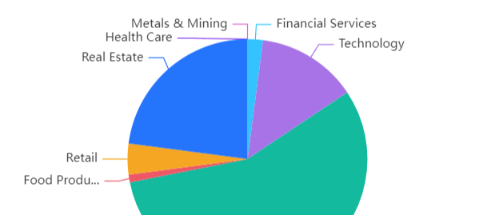
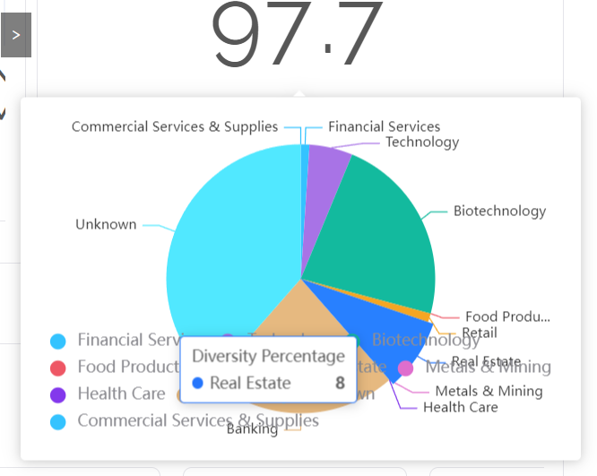
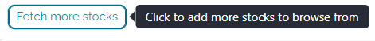
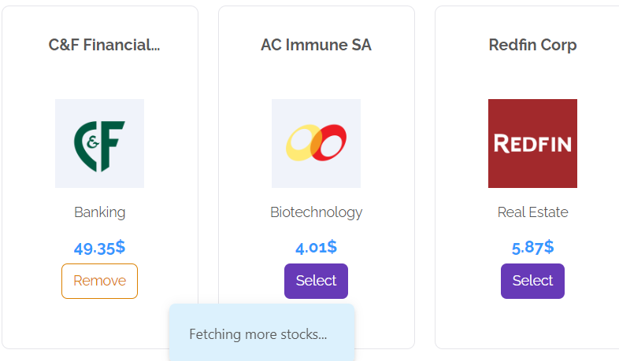
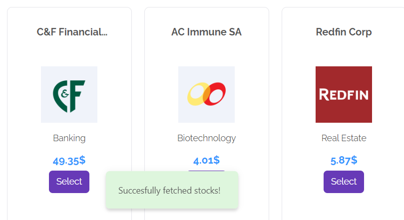
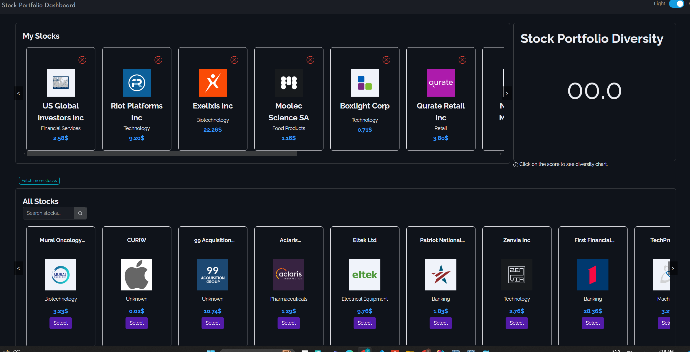
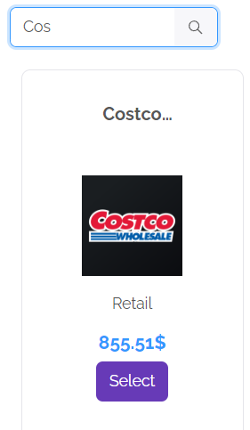

# Stock Portfolio

Welcome to the Stock Portfolio application! This project is designed to help users manage their stock investments, track performance, and analyze market trends.

## Table of Contents
- [Features](#features)
- [Installation](#installation)
- [Usage](#usage)
- [Configuration](#configuration)
- [License](#license)

## Features

<!--  -->
<div style="text-align: center;">

</div>

- **Sector Allocation Visualization**: Visualize your holdings across various sectors to understand your exposure and sector-specific risk.
- **Diversity Score**: Keep track of the diversity score the real-time calulator for your selcted stocks portfolio. Computed using the below formula, where w being the weight of each sector in the portfolio. 
\[ D = \left( 1 - \sum_{n=1}^{no. ofsectors} (w^2) \right) \cdot 100 \]

- **Comprehensive Stock Data**: Access an extensive range of stocks from the NASDAQ 100 to diversify your portfolio. 

- **Market Data Integration**: Fetch real-time stock prices and market data.
- **Alerts**: Actionable alerts enabled for significant events and errors.

- **Accessibility**: The dashboard will be soon accessible through a vercel deployment just enter your finhubb key and you will be good to go.
- **User Interface Modes**: Improve your seamless experience with support for both dark and light modes.

- **Search Functionality**: Utilize search capabilities to quickly find and choose specific stocks.
<div style="text-align: center;">
    
</div>


## Installation

To get started with the Stock Portfolio application, follow these steps:

1. Clone the repository:
   ```sh
   git clone https://github.com/k-v-n-p/stock-portfolio.git
   ```
2. Navigate to the project directory:
   ```sh
   cd stock-portfolio
   ```
3. Install the required dependencies:
   ```sh
   yarn install
   ```

## Usage

To run the application locally, use the following command:

```sh
yarn start
```

This will start the development server and you can access the application at `http://localhost:3000`.

## Configuration

Before running the application, you may need to configure some settings:

**API Keys**: The application requires API keys to fetch real-time stock data. Create a `.env` file in the root directory and add your API keys: 
   ```env
   REACT_APP_STOCK_API_KEY=your_api_key_here
   ```


<!-- ## License

This project is licensed under the MIT License. See the [LICENSE](LICENSE) file for details. -->

<!-- ---
Feel free to explore, use, and contribute to the Stock Portfolio project! If you have any questions or need further assistance, please open an issue on GitHub.
``` -->